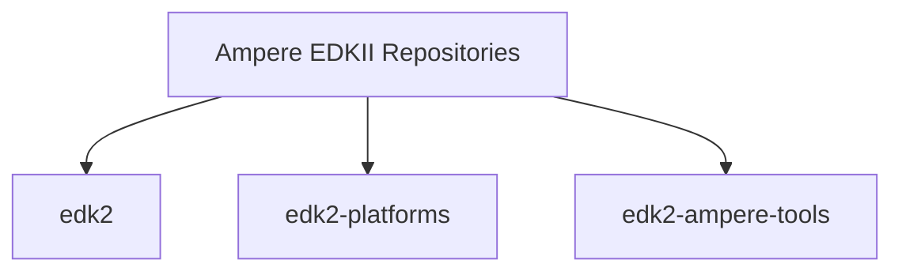
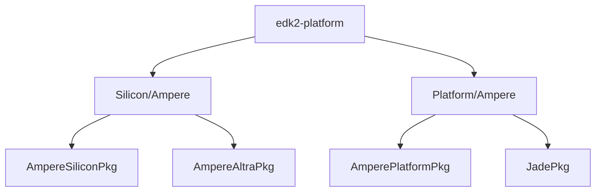

# Ampere Altra Based Platforms Porting Guide

## Overview

The purpose of this document is to describe changes commonly made when adding a new Ampere Altra based platform.

Users of this document should have prior firmware development experience with
EDKII, including knowledge of UEFI specification.

This document also assumes your new platform meets Ampere(R) Altra(R) Interface
Firmware Requirements and is working with the Ampere system firmware and Ampere
Trusted Firmware (ATF).

**Note:** Information for this guide was written based on the Ampere Tianocore v1.08.100 release.

---

## EDKII Code Organization



There are 3 repositories required for Ampere platform development:

* edk2 - contains development tools and generic EDKII modules.
* edk2-platforms - contains the silicon/platform workspace and associated modules.
* edk2-ampere-tools - provides helper Makefile and scripts to build to a final
  flash image.

The following diagram is the hierarchical structure of the silicon and platform
directory. It is designed for easy portability and cross-platform reuse between
Ampere Altra based platforms.



All the packages are currently located under Silicon/Ampere and Platform/Ampere
directories.

The following table describes the intention of the above package organization:

Directory Name    | Description
------------------|-------------------------------------------------------------
AmpereSiliconPkg  | Ampere silicon common code that can be shared for multiple silicon.
AmpereAltraPkg    | Ampere Altra specific code.
AmperePlatformPkg | Ampere hardware platform/board common code that can be shared for multiple platform.
JadePkg           | Ampere Mt. Jade Platform code. Any new platform/board should be based on this package.

## Build Instructions

The build instructions can be found in [edk2-ampere-tools's README.md](https://github.com/AmpereComputing/edk2-ampere-tools)

Don't forget to change appropriately to point to the newly-created DSC file.

---

## Porting TianoCore EDKII to a new platform

This section describes the common process of adding a new platform based on the Mt. Jade reference platform. First, construct a minimal EDK2 that can boot to UEFI Shell.
Then, enable features one-by-one such as PCIe, ACPI, SMBIOS, etc.

1. Create a vendor directory and a board directory with the pattern: `edk2-platforms/Platform/<Your Company Name>/<New Board>Pkg`. For the sake of simplicity, the new platform will be under `Platform/Ampere/NewBoardPkg`.
2. Copy `Platform/Ampere/JadePkg` to `Platform/Ampere/NewBoardPkg`.
3. Rename the file name under the `NewBoardPkg` like BoardSetting.cfg and DSC/FDF file to match the platform name.

### DSC/FDF

Replace correspondingly the `Jade`/`JADE` with `NewBoard`/`NEWBOARD` throughout the files.

### Board Setting

The Board Setting is a collection of board and hardware configurations for an Altra-based ARM64 platform.

Modify it appropriately for the new platform configuration.

Please refer to the Ampere Altra Interface Firmware Requirements at the Table 4 for detailed descriptions of each Board Setting fields.

### PCIe

The PCIe software stack is shown as below:

```
+---------------------------+
│     PciHostBridgeDxe      │  -> Silicon/Ampere/AmpereAltraPkg/Bus/Pci/PciHostBridgeDxe
+---------------------------+
│       PcieCoreLib         │  -> Silicon/Ampere/AmpereAltraPkg/Library/PcieCoreLib
+--------------+------------+
│ PcieBoardLib │ PciePhyLib │  -> Silicon/Ampere/AmpereAltraPkg/Library/PciePhyLib
+--------------+------------+
    \
     `-> Platform/Ampere/JadePkg/Library/PcieBoardLib
```

PciHostBridgeDxe, PcieCoreLib, PciePhyLib, and most of PcieBoardLib are generic and can be shared among Ampere Altra-based platforms.
The difference between platforms could be the mechanism to control the PERST line for each PCIe controller.
Platform code must modify the two functions below in the Platform/Ampere/JadePkg/Library/PcieBoardLib/PcieBoard.c to comply with specific platform hardware.

**PcieBoardReleaseAllPerst**

  ```c
  /**
    Provide the capability to release all PERST lines.

    Input:
      UINT8 SocketId: Tell the function to release all PERST that belonged to this SocketId.

    Output: None

  **/
  VOID
  PcieBoardReleaseAllPerst (
    IN UINT8 SocketId
    );
  ```

**PcieBoardAssertPerst**

  ```c
  /**
    Provide the capability to assert the PERST line of a specific PCIe controller.

    Input:
      AC01_RC *RC              : Pointer to the data structure of the parent Root Complex
                                 managed the target PCIe controller.
      UINT32  PcieIndex,       : Index of the PCIe Controller within the Root Complex.
      UINT8   Bifurcation,     : Bifurcation mode of the Root Complex.
      BOOLEAN isPullToHigh     : Set to FALSE to assert and TRUE to release the PERST line.

  **/
  VOID
  PcieBoardAssertPerst (
    AC01_RC *RC,
    UINT32  PcieIndex,
    UINT8   Bifurcation,
    BOOLEAN isPullToHigh
    );
  ```

### ACPI

The ACPI tables are split into two main parts: common ACPI tables and platform specific ACPI tables. The common tables are under AmpereAltraPkg so that they can be reused by different platforms.

In order to modify the platform specific tables under `Platform/Ampere/NewBoardPkg/AcpiTables`, update correspondingly with the following points:

* DSDT/GED1 Device (Shutdown Button)
  * The interrupt number, which is currently set to 327.
* DSDT/I2C4 Device (IPMI SSIF)
  * The values of the SSCN (Standard Mode) and FMCN (Fast Mode) based on the new platform's frequency calibration.
  * The BMC slave address in the I2cSerialBusV2 () function, which is currently set to 0x0010.
* DSDT/UART Devices
  * There are three UART devices that can be used by EDK2:
    * UART0 for ACPI SPCR table (CPU main console)
    * UART2 for ACPI DBG2 table
    * UART3: non-use
  * Add or remove UART devices based on the platform configuration.

### SMBIOS

They are categorized into 3 main modules:

* SmbiosPlatformDxe: SMBIOS Type 0, 1, 2, 3, 4, 5, 6.
* SmbiosCpuDxe: SMBIOS Type 4 and 7.
* SmbiosMemInfoDxe: SMBIOS Type 16, 17, and 19.

In order to enable the SMBIOS support,

* Modify these `Platform/Ampere/NewBoardPkg/Drivers/SmbiosPlatformDxe/SmbiosPlatformDxe.c` files appropriately with the following notes:
  * Default strings
    * `VENDOR_TEMPLATE`
    * `BIOS_VERSION_TEMPLATE`
    * `MANUFACTURER_TEMPLATE`
    * `PRODUCT_NAME_TEMPLATE`
    * `SYS_VERSION_TEMPLATE`
    * `SERIAL_TEMPLATE`
    * `SKU_TEMPLATE`
* Update fixed SMBIOS tables (i.e type 8, 9, 13, ...) corresponding to your platform design.
* Most of fields in SMBIOS Type 1, 2, and 3 are fetched from FRU Device via the IPMI SSIF interface. If the new platform does not support the IPMI SSIF, please drop the support, especially the `IpmiFruInfo.c` file.

### RTC

On Ampere Mt. Jade, the hardware RTC connects to I2C6 on the master socket and validated with PCF85063AT chip. The GPI4 is dedicated for obtaining exclusive access because the RTC is shared between BMC and the SoC.

If you use the same RTC hardware on the new platform, modify appropriately the following macros for the I2C and GPI:

* GPI
  * `I2C_RTC_ACCESS_GPIO_PIN`: RTC Access Lock
* I2C
  * `I2C_RTC_BUS_ADDRESS`: I2C bus
  * `I2C_RTC_BUS_SPEED`: I2C bus speed
  * `I2C_RTC_CHIP_ADDRESS`: I2C slave address of the RTC

If you use a different RTC on the new platform, you will need to port to the new hardware RTC chip.

You can also leverage `EmbeddedPkg/Library/VirtualRealTimeClockLib/VirtualRealTimeClockLib.inf` if the hardware RTC has not supported yet.

### IPMI/SSIF

The IPMI SSIF is used for the communication between the BMC and the SoC. It requires the following modules:

* `Silicon/Ampere/AmpereAltraPkg/Drivers/SmbusHcDxe/SmbusHcDxe.inf`: This driver produces the SMBUS protocol.
* `Silicon/Ampere/AmpereSiliconPkg/Library/IpmiCommandLibExt/IpmiCommandLibExt.inf`: This library instance provides supplementary IPMI Commands to the `Features/Intel/OutOfBandManagement/IpmiFeaturePkg/Library/IpmiCommandLib`.
* `Silicon/Ampere/AmpereSiliconPkg/Drivers/IpmiSsifDxe/IpmiSsifDxe.inf`: This driver produces the IPMI protocol.
* `Platform/Ampere/NewBoardPkg/Library/DxePlatformSmbusLib/DxePlatformSmbusLib.inf`: This library layers on top of the SMBUS protocol to provide platform specific SMBUS API functions. On the Mt. Jade platform, the SoC relies on the GPI0 (referred to as BMC READY GPIO) to determine whether the BMC is ready for the communication.

In order to enable the IPMI SSIF support:

1. Ensure that the I2C4 is connected to the BMC and the frequency is operated at 400KHz.
2. Update correspondingly the following PCDs if there are different configuration from the BMC slave address and the BMC READY GPIO.
   * gAmpereTokenSpaceGuid.PcdBmcSlaveAddr
   * gAmpereTokenSpaceGuid.PcdBmcReadyGpio

### Signed Capsule Update

There are two types of the firmware image supported on the Ampere Mt. Jade platform:

* The combination of Ampere Trusted Firmware (ATF) FIP, Board Settings, and EDK2 FD.
* Ampere System Firmware (SCP Firmware)

In order to enable the capsule update feature, update the IMAGE_ID and IMAGE_ID_STRING to match the platform name in the `Platform/Ampere/NewBoardPkg/Capsule/SystemFirmwareDescriptor/SystemFirmwareDescriptor.aslc` file.

Please refer to [Capsule Based Firmware Update and Firmware Recovery](https://github.com/tianocore/tianocore.github.io/wiki/Capsule-Based-Firmware-Update-and-Firmware-Recovery) for detailed porting instructions.

### Trusted Platform Module (TPM)

No change is needed.

It's important that the ATF running on the new platform must comply with the Ampere Altra Interface Firmware Requirements.

---

## Contact Information

If you have the patches and want to share with Ampere, use git-send-mail to Ampere EDK2 maintainers/reviewers
* Nhi Pham <nhi@os.amperecomputing.com>
* Vu Nguyen <vunguyen@os.amperecomputing.com>
* Thang Nguyen <thang@os.amperecomputing.com>
* Phong Vo <phong@os.amperecomputing.com>
* Chuong Tran <chuong@os.amperecomputing.com>

For any technical questions that you want to consult with, send email to Ampere Support support@amperecomputing.com.
